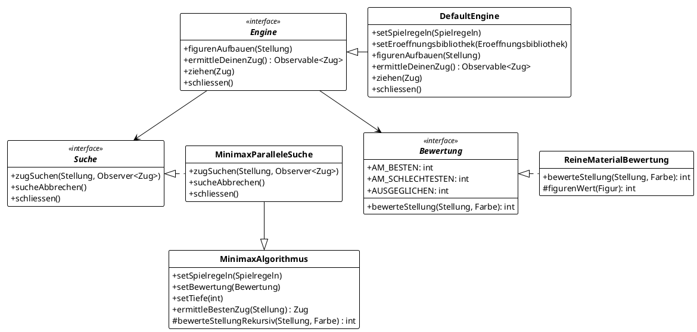

<!-- markdownlint-disable MD036 -->
# DokChess, C4-Sichten

Software-Architektur-Sichten nach der [C4-Methode](https://c4model.com/) für die [DokChess-Schach-Engine](https://github.com/DokChess/dokchess).

Stefan Zörner hat DokChess als Beispiel für eine Architekturdokumentation mit der [arc42-Vorlage](https://www.arc42.de/) konzipiert. Diese Dokumentation findet man [online](https://www.dokchess.de/) und auch in seinem [Buch](https://www.swadok.de/) "Softwarearchitekturen dokumentieren und kommunizieren: Entwürfe, Entscheidungen und Lösungen nachvollziehbar und wirkungsvoll festhalten".  Dieses Dokument soll die Dokumentation nicht ersetzen, sondern alternative Darstellungen (insbesondere der Diagramme) nach der C4-Methode liefern.

## Hinweise zur C4-Umsetzung

Auf der C4-Webseite gibt es einen [Hinweis, wie man C4 mit arc42 kombinieren kann](https://c4model.com/diagrams/faq#can-we-combine-c4-and-arc42):

> Can we combine C4 and arc42? Yes, many teams do, and the C4 model is compatible with the arc42 documentation template as follows.
>
> - Context and Scope => System Context diagram
> - Building Block View (level 1) => Container diagram
> - Building Block View (level 2) => Component diagram
> - Building Block View (level 3) => Code (e.g. class) diagram

Außerdem wird als [Container](https://c4model.com/abstractions/container) unter anderem auch das Dateisystem aufgelistet.
>
> In real terms, a container is something like:
>
> - ...
> - File system: A full local file system or a portion of a larger networked file system (e.g. SAN, NAS, etc).
> - ...

Da die Eröffnungsbibliothek kein von einem eigenständigen Team entwickeltes System ist, das für sich selbst als Prozess läuft und über ein (Netzwerk-)Protokoll mit DokChess kommuniziert, sondern eine Datei im "Polyglot Opening Book"-Format, welche bei Programmstart eingelesen wird, erfolgt keine Darstellung der Eröffnungsbibliothek auf oberster Ebene (Context), sondern erst auf zweiter Ebene (Container, Filesystem).

Weiterhin stellt sich die Frage, wie die einzelnen Teile (Bausteine) der von DokChess klassifiziert werden sollten. Hier passt die Beschreibung auf der C4-Webseite zum Thema [Komponente](https://c4model.com/abstractions/component):

> A component is a way to step up one level of abstraction from the code-level building blocks that you have in the programming language that you’re using. For example:
>
> - Object-oriented programming languages (e.g. Java, C#, C++, etc): A component is made up of classes and interfaces.
> - ...

Das bedeutet jedoch, dass die detailliertere Beschreibung der einzelnen Teile der Engine (Suche und Bewertung) erst in der Code-Ebene dargestellt werden können, wenn man keine weiteren Abstraktionsebenen zum C4-Modell hinzufügen möchte.

## Software-System (Context)

```plantuml
@startuml dokchess-c4-context
!theme C4Language_german from <C4/themes>
!include <C4/C4_Context>

Person(mensch, "Menschlicher Gegner", "Schachspieler am Computer")
System_Ext(client, "XBoard-Client", "z.B. 'arena' unter Windows")
System_Ext(computer, "Computergegner", "z.B. andere Engine, optional")
System(dokchess, "DokChess", "Schachengine")

Rel(mensch, client, "bedient", "Maus und Tastatur")
Rel(client, dokchess, "kommuniziert Züge mit", "XBoard-Protokoll")
Rel(computer, dokchess, "kommuniziert Züge mit", "XBoard-Protokoll")

SHOW_FLOATING_LEGEND()
@enduml
```

*Abbildung: System-Kontext-Diagramm*

Wir zeigen hier auf oberster (abstraktester) Ebene, wie die DokChess-Engine in die Systemlandschaft eingebettet ist. Wichtiger Punkt: Der Benutzer kommuniziert nicht direkt mit DokChess, sondern über die Einbindung in einen XBoard-kompatiblen Client.

## Container

```plantuml
@startuml dokchess-c4-container
!theme C4Language_german from <C4/themes>
!include <C4/C4_Container>

System_Ext(client, "XBoard-Client")

System_Boundary(dokchess, "DokChess") {
    Container(engine, "DokChess Spiel-Engine")
    Container_Ext(opening, "Eröffnungen", "Filesystem")
    Container_Ext(endgame, "Endspiele", "nicht umgesetzt")
}

Rel_R(client, engine, "bindet ein", "XBoard-Protokoll: Standardein-/ausgabe")
Rel(engine, opening, "schlägt Eröffnungszug nach in", "Polyglot Opening Book format")
Rel(engine, endgame, "schlägt Endspielzug nach in", "nicht umgesetzt")

SHOW_FLOATING_LEGEND()
@enduml
```

*Abbildung: Funktionale Aufteilung des DokChess-Systems in Container*

Die DokChess-Engine lädt Eröffnungen aus dem Dateisystem im "Polyglot Opening Book"-Format, um auf bekannte Eröffnungszüge mit dem optimalen Zug antworten zu können. Die Einbindung einer Eröffnungsdatei ist optional. Wird keine angegeben, berechnet die Engine selbst einen möglichst guten Antwortzug.

In Zukunft könnte durch Anbindung einer Endspieldatei auch für bekannte Endspielsituationen auf vorberechnete Züge geantwortet werden. Dies ist im jetzigen System noch nicht vorgesehen.

## Komponenten (Component)

```plantuml
@startuml dokchess-c4-component
!theme C4Language_german from <C4/themes>
!include <C4/C4_Component>

System_Ext(client, "XBoard-Client")

Container_Boundary(xboardClient, "DokChess Spiel-Engine") {
    Component(xboardProtocol, "XBoard-Protokoll", "", "Realisiert die Kommunikation mit einem Client mit Hilfe des XBoard-Protokolls")
    Component(rules, "Spielregeln", "", "Beinhaltet die Schachregeln und kann z.B. zu einer Stellung alle gültigen Züge ermitteln")
    Component(engine, "Engine", "", "Beinhaltet die Ermittlung eines nächsten Zuges ausgehend von einer Spielsituation")
    Component(openings, "Eröffnungen", "", "Stellt Züge aus der Eröffnungsliteratur zu einer Spielsituation bereit.")
}

Rel_R(client, xboardProtocol, "Kommuniziert über das XBoard-Protokoll")

Container_Ext(polyglot, "Eröffnungen", "Dateisystem: Polyglot Opening Book")

Rel_R(xboardProtocol, rules, "Zug auf Gültigkeit überprüfen")
Rel_D(xboardProtocol, engine, "Züge ermitteln und ausführen")
Rel_R(engine, rules, "Zug auf Gültigkeit überprüfen")
Rel(engine, openings, "Züge während der Eröffnungsphase finden")
Rel(openings, polyglot, "Eröffnungen nachschlagen")

SHOW_FLOATING_LEGEND()
@enduml
```

*Abbildung: Funktionale Aufteilung der DokChess-Spiel-Engine*

## Code



*Abbildung: Umsetzung der DokChess-Engine-Komponente im Code*

## Dynamisches Zusammenspiel

```plantuml
@startuml dockchess-c4-dynamic
!theme C4Language_german from <C4/themes>
!include <C4/C4_Dynamic>

System_Ext(c, "XBoard-Client")
Component(x, "XBoard-Protokoll", "", "Realisiert die Kommunikation mit einem Client mit Hilfe des XBoard-Protokolls")
Component(r, "Spielregeln", "", "Beinhaltet die Schachregeln und kann z.B. zu einer Stellung alle gültigen Züge ermitteln")
Component(e, "Engine", "", "Beinhaltet die Ermittlung eines nächsten Zuges ausgehend von einer Spielsituation")
Component(o, "Eröffnungen", "", "Stellt Züge aus der Eröffnungsliteratur zu einer Spielsituation bereit.")

Rel(c, x, "'e2e4'")
Rel(x, r, "liefereGueltigeZuege")
Rel(r, x, ":Zug[]")
Rel(x, e, "ziehen(e2-e4)")
Rel(x, e, "ermittleDeinenZug")
Rel(e, o, "liefereZug")
Rel(o, e, ":null")
Rel(e, r, "liefereGueltigeZuege")
Rel(r, e, ":Zug[]")
Rel(e, x, "Zug (e7-e5)")
Rel(e, x, "Zug (b8-c6)")
Rel(e, x, "fertig")
Rel(x, e, "ziehen (b8-c6)")
Rel(x, c, ":'move b8c6'")

SHOW_FLOATING_LEGEND()
@enduml
```

*Abbildung: Beispielhaftes Zusammenspiel für eine Zugermittlung*

## Deployment

```plantuml
@startuml dockchess-c4-deployment
!theme C4Language_german from <C4/themes>
!include <C4/C4_Deployment>

Deployment_Node(win, "Windows PC") {
    Deployment_Node(ds, "Dateisystem") {
        Container(bat, "dokchess.bat")
        Container(e, "Eröffnungen")
    }
    Deployment_Node(pr, "Windowsprozess") {
        Container(exe, "Arena Chess Gui.exe")
    }
    Deployment_Node(java, "Java-Laufzeitumgebung") {
        Container(jar, "DokChess.jar")
    }
}

Rel(pr, bat, "benutzt als hinterlegte Engine")
Rel(bat, java, "startet")
Rel(java, e, "liest ein")

SHOW_FLOATING_LEGEND()
@enduml
```

*Abbildung: Ausführung der DokChess-Engine auf einem Windows-PC*
