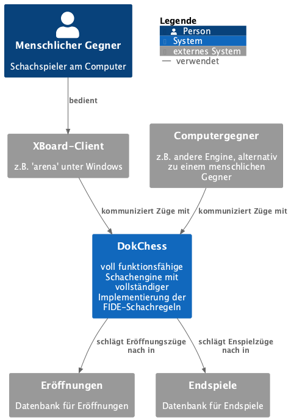
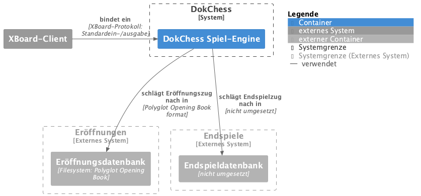
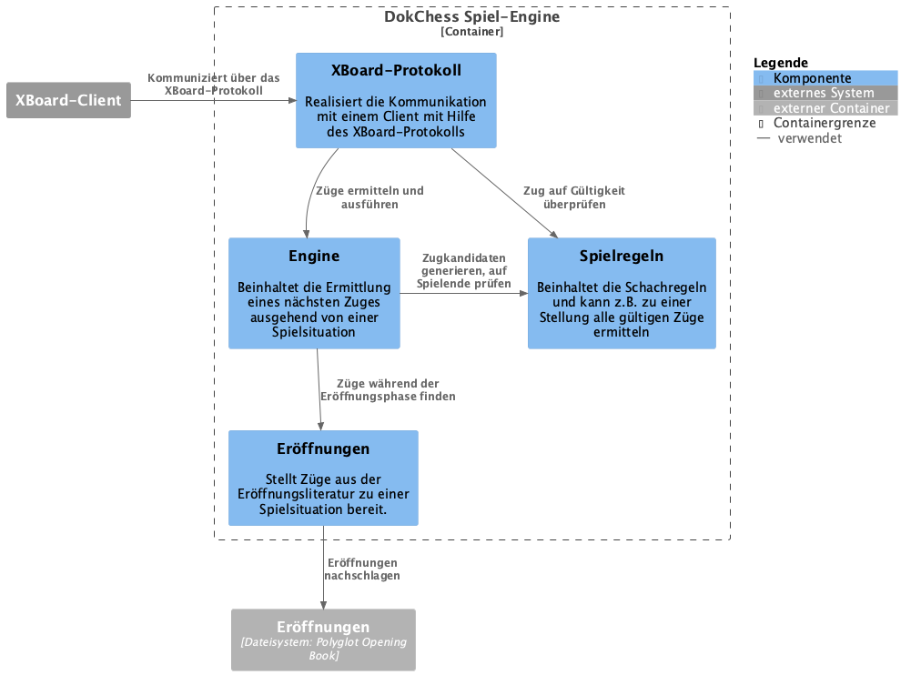
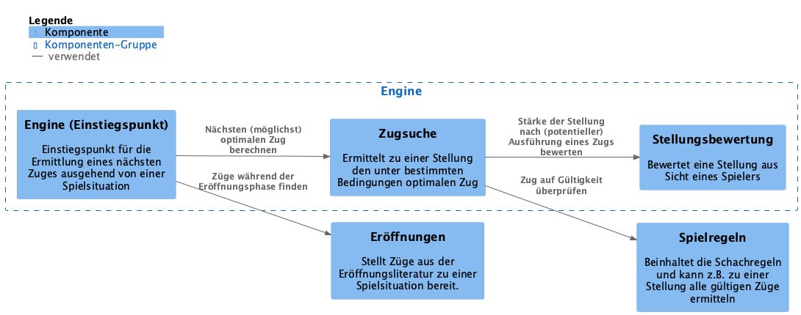
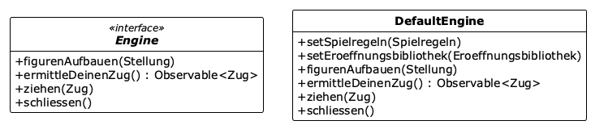
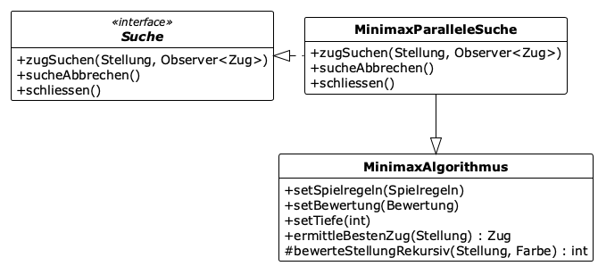
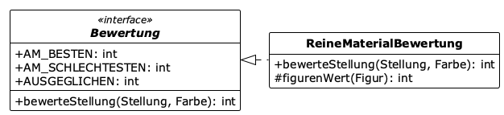
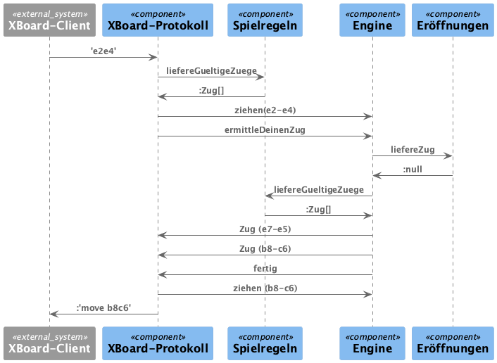
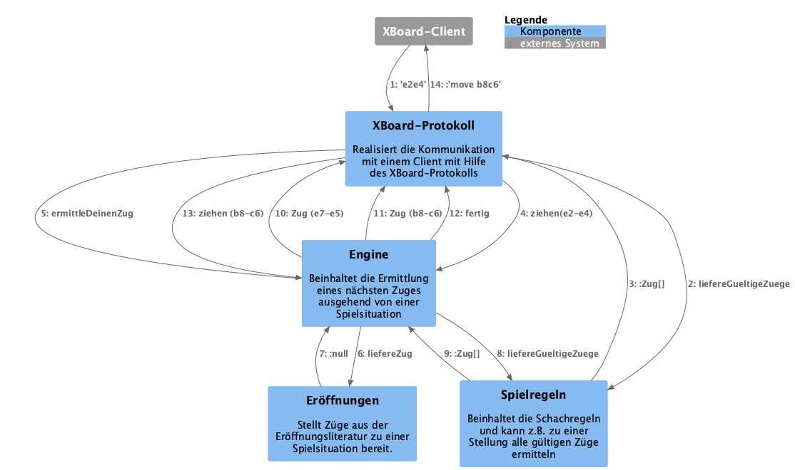
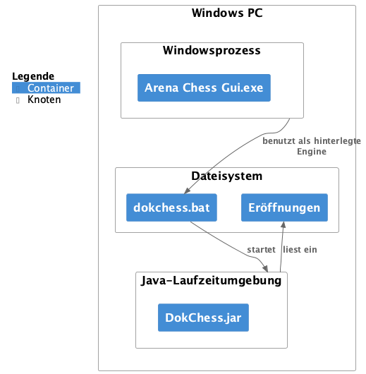

<!-- markdownlint-disable MD036 -->
# DokChess, C4-Sichten <!-- omit in toc -->

Software-Architektur-Sichten nach dem [C4-Modell](https://c4model.com/) für die [DokChess-Schach-Engine](https://github.com/DokChess/dokchess), erstellt von Johannes Schneider. Vielen Dank an Stefan Zörner für seine detaillierten und hilfreichen Kommentare!

## Inhalt <!-- omit in toc -->

- [Einleitung](#einleitung)
- [Software-System (Context)](#software-system-context)
- [Container](#container)
- [Komponenten (Component)](#komponenten-component)
- [Code](#code)
- [Dynamisches Zusammenspiel (Dynamic Diagram)](#dynamisches-zusammenspiel-dynamic-diagram)
- [Deployment (Deployment diagram)](#deployment-deployment-diagram)
- [Lizenz dieses Dokuments](#lizenz-dieses-dokuments)

## Einleitung

Stefan Zörner hat DokChess als Beispiel für eine Architekturdokumentation mit der [arc42-Vorlage](https://www.arc42.de/) konzipiert. Diese Dokumentation findet man [online](https://www.dokchess.de/) und auch in seinem [Buch](https://www.swadok.de/) "Softwarearchitekturen dokumentieren und kommunizieren: Entwürfe, Entscheidungen und Lösungen nachvollziehbar und wirkungsvoll festhalten".

Bei dem von Simon Brown entwickelten [C4-Modell](https://c4model.com/) werden Software-System über vier Abstraktionsebenen (Context, Container, Component, Code) beschrieben. Für jede Ebene gibt es einen entsprechenden Architektursichtentyp inklusive passender Elemente.

Dieses Dokument liefert einen Vorschlag, wie man das DokChess-System über diese vier Abstraktionsebenen darstellen kann. Die hier vorgestellten Sichten kann man (alternativ oder ergänzend zu bestehenden Diagrammen) in einer Architekturdokumentation verwenden. So erklärt Simon Brown auf der C4-Webseite beispielsweise, [wie man C4 mit arc42 kombinieren kann](https://c4model.com/diagrams/faq#can-we-combine-c4-and-arc42):

> Can we combine C4 and arc42? Yes, many teams do, and the C4 model is compatible with the arc42 documentation template as follows.
>
> - Context and Scope => System Context diagram
> - Building Block View (level 1) => Container diagram
> - Building Block View (level 2) => Component diagram
> - Building Block View (level 3) => Code (e.g. class) diagram

Alternative Gliederungsvorschläge einer Softwarearchitekturdokumentation findet man in Simon Browns "[The Software Guidebook](https://leanpub.com/documenting-software-architecture)" oder auch in Form der [ADF-Architekturdokumentationsvorlage](https://github.com/architecture-decomposition-framework/adf-documentation-template).

Man findet in diesem Dokument also **keine** komplette Architekturdokumentation des DokChess-Systems, sondern lediglich Diagramme, die man für eine Dokumentation verwenden kann, zusammen mit Hinweisen, warum die Diagramme so erstellt wurden. Wer Näheres über die genaue Funktionsweise von DokChess und die dahinterliegenden Designentscheidungen lernen möchte, findet dies [online](https://www.dokchess.de/) in der vorhandenen Dokumentation.

## Software-System (Context)

*Abbildung: System-Kontext-Diagramm von DokChess*

Wir zeigen hier auf oberster (abstraktester) Ebene, wie die DokChess-Engine in die Systemlandschaft eingebettet ist. Wichtiger Punkt: Der Benutzer kommuniziert üblicherweise nicht direkt mit DokChess, sondern über die Einbindung in einen XBoard-kompatiblen Client.

Dieses Diagramme ist eher fachlich als technisch ausgerichtet. Daher wurden für die Relationen keine spezifischen Technologie-Annotationen gewählt.

## Container

*Abbildung: Funktionale Aufteilung des DokChess-Systems in Container*

Die DokChess-Engine lädt Eröffnungen aus einer Eröffnungsdatenbank, um auf bekannte Eröffnungszüge mit dem optimalen Zug antworten zu können. Die Einbindung einer solchen Datenbank ist optional. Wird keine angegeben, berechnet die Engine selbst einen möglichst guten Antwortzug.

In Zukunft könnte durch Anbindung einer Endspieldatenbank auch für bekannte Endspielsituationen mit optimalen Zügen geantwortet werden. Dies ist im jetzigen System noch nicht vorgesehen.

Dieses Diagramm zeigt schon zwei wichtige technische Entscheidungen: Die Verwendung von XBoard als Kommunikationsprotokoll mit dem Client sowie das Polyglot-Opening-Book-Format für die Eröffnungsbibliotheken.

Dass die Eröffnungsbibliothek kein von einem eigenständigen Team entwickeltes System (z.B. ein Datenbankserver) ist, das für sich selbst als Prozess läuft und über ein (Netzwerk-)Protokoll mit DokChess kommuniziert, sondern eine Datei im "Polyglot Opening Book"-Format, welche bei Programmstart eingelesen wird, ist letztlich eine Umsetzungsentscheidung, welche jedoch mit der Container-Darstellung kompatibel ist, da im C4-Modell als [Container](https://c4model.com/abstractions/container) unter anderem auch das Dateisystem aufgelistet.
>
> In real terms, a container is something like:
>
> - ...
> - Database: A schema or database in a relational database management system, document store, graph database, etc such as MySQL, Microsoft SQL Server, Oracle Database, MongoDB, Riak, Cassandra, Neo4j, etc.
> - ...
> - File system: A full local file system or a portion of a larger networked file system (e.g. SAN, NAS, etc).
> - ...

## Komponenten (Component)

Als nächste Unterteilungsebene folgt die Komponentensicht. Hier kann man die in der arc42-Dokumentation vorhandene [Bausteinsicht der Ebene 1](https://www.dokchess.de/05_bausteinsicht/01_ebene_1/) ziemlich direkt in ein C4-Komponentendiagramm überführen und noch die Beschreibung der einzelnen Elemente hinzufügen.

*Abbildung: Funktionale Aufteilung der DokChess-Spiel-Engine*

Die einzelnen Komponenten werden im Code durch Klassen und Interfaces umgesetzt, was zur Beschreibung auf der C4-Webseite zum Thema [Komponente](https://c4model.com/abstractions/component) passt:

> A component is a way to step up one level of abstraction from the code-level building blocks that you have in the programming language that you’re using. For example:
>
> - Object-oriented programming languages (e.g. Java, C#, C++, etc): A component is made up of classes and interfaces.
> - ...

Eine weitere, detailliertere Beschreibung einer Komponente erfolgt nun üblicherweise über die Code-Sicht, da C4 keine Unterteilung von Komponenten in Unterkomponenten vorsieht, siehe [Abbildung "A software system is made up of ..."](https://c4model.com/abstractions); zudem gibt es weder in der [C4-PlantUML-Bibliothek](https://github.com/plantuml-stdlib/C4-PlantUML) noch in Simon Browns [Structurizr](https://structurizr.com/) Tool-Support für Komponenten innerhalb von Komponenten.

Der Autor dieses Dokuments hält es jedoch für eine sehr hilfreiche Zusatzinformation zum besseren Verständnis der DokChess-Engine, eine weitere Stufe in das System "hineinzoomen" zu können (Laufzeitsicht, Design), ohne bereits auf die Code-Ebene (Entwicklungszeitsicht, Implementierung) eingehen zu müssen. Daher wurde zusätzlich dieses Komponentendiagramm erstellt, welches der [Bausteinsicht der Ebene 2](https://www.dokchess.de/05_bausteinsicht/06_ebene_2_engine/) der arc42-Dokumentation entspricht und die Engine-Komponente näher beschreibt.

*Abbildung: Funktionale Unterteilung der Engine*

Wenn man diese hier dargestellte, weitere Zoomstufe vermeiden möchte, gibt es folgende Alternativen:

- **Darstellung der Engine auf Code-Ebene (wie oben schon angesprochen)**. Damit muss man sich aber bereits um Implementierungsdetails kümmern, welche beim Design eines Systems vielleicht noch gar nicht feststehen oder sich auch gerne mal ändern können.
- **Darstellung der Interna der Engine direkt schon im Komponentendiagramm "Funktionale Aufteilung der DokChess-Spiel-Engine"**. Dies macht das Komponentendiagramm weniger übersichtlich und impliziert, dass die Unterkomponenten der Engine (z.B. Zugsuche) dieselbe Wichtigkeit haben wie die Top-Level-Komponenten (z.B. Spielregeln).
- **Darstellung der Komponenten aus dem Diagramm "Funktionale Aufteilung der DokChess-Spiel-Engine" als Container**. Indem man XBoard-Protokoll, Engine, Spielregeln und Eröffnungen bereits auf höherer Ebene als Container darstellt, hat man die Möglichkeit, diese Container auf der Komponenten-Ebene weiter zu zerlegen. Diese Aufteilung wäre inhaltlich für einen Leser/eine Leserin der Dokumentation gut nachvollziehbar, widerspricht aber der [Definition eines Containers](https://c4model.com/abstractions/container).

## Code

Simon Brown [empfiehlt](https://c4model.com/diagrams/code), Diagramme der Code-Ebene, wenn man sie überhaupt braucht, direkt aus dem Code generieren zu lassen. Beispielhaft sind hier einige der UML-Klassendiagramme der arc42-Dokumentation übernommen.

*Abbildung: Umsetzung der Engine-Komponente im Code*

*Abbildung: Umsetzung der Zugsuche-Komponente im Code*

*Abbildung: Umsetzung der Stellungsbewertung-Komponente im Code*

## Dynamisches Zusammenspiel (Dynamic Diagram)

Es ist oft hilfreich, das dynamische Zusammenspiel von Einzelteilen eines Systems zu veranschaulichen. In der arc42-Vorlage findet man solche Diagramme im Kapitel Laufzeitsicht. Auch das C4-Modell sieht [Dynamische Diagramme](https://c4model.com/diagrams/dynamic) vor, die "sparsam verwendet werden sollten, um interessante/wiederkehrende Muster oder Funktionen zu zeigen, die eine komplizierte Reihe von Interaktionen erfordern." (übersetzt von der C4-Webseite).

*Abbildung: Beispielhaftes Zusammenspiel für eine Zugermittlung (Sequence-Diagramm)*

Neben der bekannten Beschreibung als UML-Sequenz-Diagramm kann man Interaktion alternativ auch in einem an UML-Kommunikationsdiagramme angelehnten Stil beschreiben. Bei einer kleineren Anzahl an Interaktionen ist diese Darstellungsform besonders dann sehr hilfreich, wenn man die Komponenten an derselben Stelle wie im statischen Komponentendiagramm wiederfindet. 

Der Vollständigkeit halber ist obiges Sequenzdiagramm hier noch als Kommunikationsdiagramm angefügt. Aufgrund der großen Anzahl von Interaktionen zwischen XBoard-Protokoll und Engine ist dieses konkrete Beispiel hier jedoch eher unübersichtlich.

*Abbildung: Beispielhaftes Zusammenspiel für eine Zugermittlung (Dynamisches Diagramm)*

## Deployment (Deployment diagram)

[Deployment-Diagramme](https://c4model.com/diagrams/deployment) können ergänzend zu den vier Diagrammtypen der C4-Abstraktionsebenen verwendet werden, um "zu veranschaulichen, wie Instanzen von Softwaresystemen und/oder Containern im statischen Modell auf die Infrastruktur in einer bestimmten Deyployment-Umgebung (z.B. Produktion, Staging, Entwicklung, etc.) bereitgestellt werden." (übersetzt von der C4-Webseite).

*Abbildung: Ausführung der DokChess-Engine auf einem Windows-PC*

## Lizenz dieses Dokuments

Das Copyright (C) 2024 liegt bei Johannes Schneider, der den Inhalt dieses Dokuments (Text und Abbildungen) unter der Lizenz [CC BY-NC-SA 4.0](https://creativecommons.org/licenses/by-nc-sa/4.0/deed.de) veröffentlicht.
